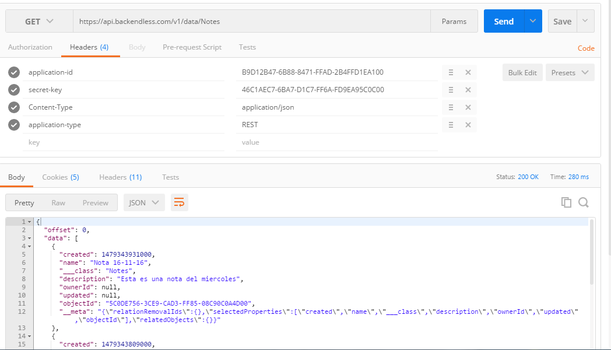

  # Requisitos 
  
    1. Cuenta en BackendLess
    
    2. Postman [https://www.getpostman.com/](https://www.getpostman.com/)
    
    3. Json Editor [http://www.jsoneditoronline.org/#/](http://www.jsoneditoronline.org/#/)
    
    4. Http Status [https://httpstatuses.com/](https://httpstatuses.com/)
    
  # Pasos 
  
  1. Guardar una nota
  
    - Documentación :
    
    https://backendless.com/documentation/data/rest/data_saving_data_objects.htm
    
    URL : ``` https://api.backendless.com/<version>/data/<table-name>```
    
    Path : https://api.backendless.com/v1/data/Notes
    
    Method: POST
    
    Request Header :
    ```
      application-id: app-id-value
      secret-key: secret-key-value
      Content-Type:application/json
      application-type: REST
    ```
    
    Request Body :
    ```
      {
       "name" : value,
       "description" : value,
      }
    ```
    Response Body :
    
    ```
        {
          "created": 1465426355000,
          "name": "nota desde android",
          "___class": "Notes",
          "description": "esta es una nota de prueba",
          "ownerId": null,
          "updated": null,
          "objectId": "F9E7E58F-4409-08CB-FFCB-64D5BB741100",
          "__meta": "{\"relationRemovalIds\":{},\"selectedProperties\":[\"created\",\"___saved\",\"name\",\"___class\",\"description\",\"ownerId\",\"updated\",\"objectId\"],\"relatedObjects\":{}}"
        }
    ```
  2.  Probar en Postman
  
     
       
     
     
  3. MVP
   - Nuestra View sería una interfaz "AddNoteView"
      ```
              public interface AddNoteView {

          void showLoading();
          void hideLoading();
          Context getContext();

          void onMessageError(String message);
          void onAddNoteSuccess();
      }
      ```
   - En el model tendriamos la entidad NoteEntity y NoteRaw
   
   ```
       public class NoteRaw {

        private String name;
        private String description;

        public String getName() {
            return name;
        }

        public void setName(String name) {
            this.name = name;
        }

        public String getDescription() {
            return description;
        }

        public void setDescription(String description) {
            this.description = description;
        }
    }

   ```
   
   ```
        public class NoteEntity implements Serializable {

        private int id;
        private String name;
        private String objectId;
        private String description;
        private String path;

        public NoteEntity() {
        }

        public NoteEntity(int id, String name, String description, String path) {
            this.id = id;
            this.name = name;
            this.description = description;
            this.path = path;
        }

        public NoteEntity(String name, String description, String path) {
            this.name = name;
            this.description = description;
            this.path = path;
        }

        public String getObjectId() {
            return objectId;
        }

        public void setObjectId(String objectId) {
            this.objectId = objectId;
        }

        public int getId() {
            return id;
        }

        public void setId(int id) {
            this.id = id;
        }

        public String getName() {
            return name;
        }

        public void setName(String name) {
            this.name = name;
        }

        public String getDescription() {
            return description;
        }

        public void setDescription(String description) {
            this.description = description;
        }

        public String getPath() {
            return path;
        }

        public void setPath(String path) {
            this.path = path;
        }

        @Override
        public String toString() {
            return "NoteEntity{" +
                    "id=" + id +
                    ", name='" + name + '\'' +
                    ", description='" + description + '\'' +
                    ", path='" + path + '\'' +
                    '}';
        }
    }
   ```
   - Y nuestro Presenter
   
   ```
        public class NotePresenter {

        private static final String TAG = "NotePresenter";
        private final String ERROR_MESSAGE= "Ocurriò un error";
        private AddNoteView addNoteView;
        private String name,description;

        public   void attachedView(AddNoteView addNoteView){
            this.addNoteView = addNoteView;
        }

        public  void detachView(){
            this.addNoteView=null;
        }

        public void addNote(String name, String desc ){
            NoteRaw noteRaw= new NoteRaw();
            noteRaw.setName(name);
            noteRaw.setDescription(desc);

            addNoteView.showLoading();
            Call<NoteResponse> call = ApiClient.getMyApiClient().addNote(noteRaw);
            call.enqueue(new Callback<NoteResponse>() {
                @Override
                public void onResponse(Call<NoteResponse> call, Response<NoteResponse> response) {
                    if(response.isSuccessful()){
                        addNoteSuccess(response.body());
                    }else {
                        addNoteError(ERROR_MESSAGE);
                    }
                }

                @Override
                public void onFailure(Call<NoteResponse> call, Throwable t) {
                    String json="Error ";
                    try {
                        json= new StringBuffer().append(t.getMessage()).toString();
                    }catch (NullPointerException e) {}
                    Log.v(TAG, "json >>>> " + json);

                    addNoteError(json);
                }
            });

        }
        public void addNoteSuccess(NoteResponse noteResponse){

            if(noteResponse!=null){
                NoteEntity noteEntity= new NoteEntity();
                noteEntity.setObjectId(noteResponse.getObjectId());
                noteEntity.setName(noteResponse.getName());
                noteEntity.setDescription(noteResponse.getDescription());
            }
            addNoteView.hideLoading();
            addNoteView.onAddNoteSuccess();
        }

        public void addNoteError(String messageError){
            addNoteView.hideLoading();
            addNoteView.onMessageError(messageError);
        }
    }

   ```
 
