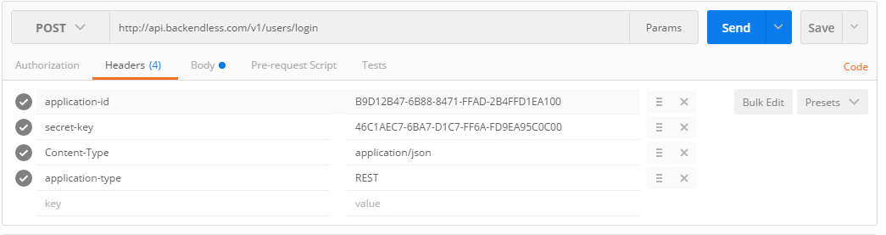
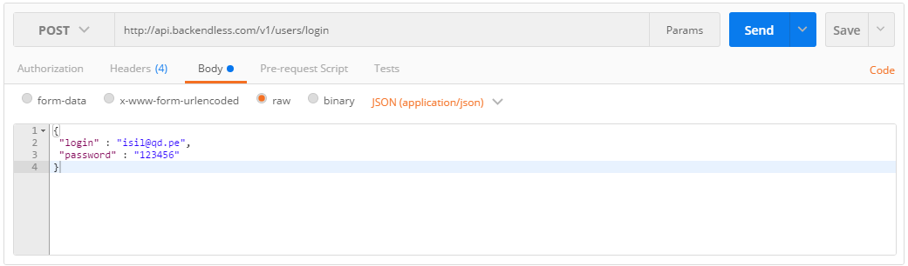
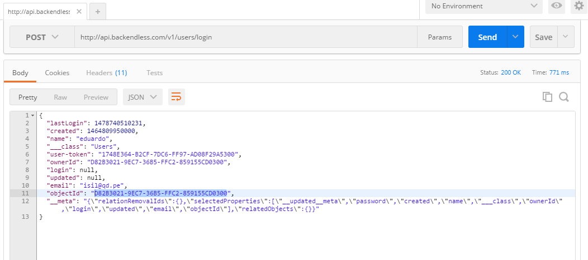

## REST Endpoints Backendless
  
  # Requisitos 
    1. Cuenta en BackendLess
    2. Postman [https://www.getpostman.com/](https://www.getpostman.com/)
    3. Json Editor [http://www.jsoneditoronline.org/#/](http://www.jsoneditoronline.org/#/)
    4. Http Status [https://httpstatuses.com/](https://httpstatuses.com/)
    
  # Pasos 
  1. Crear aplicación  de Backenless
    - Modificar la tabla Users
    
      email(STRING) | name(STRING)  | password(STRING) | objectId(STRING)
      ------------ | ------------- | ------------- | -------------
      admin@gmail.com | Admin | 123456 | D82B3021-9EC7-36B5-FFC2-859155CD0300

    - Crear la tabla Notes
    
      description(STRING) | name(STRING)  | objectId(STRING)
      ------------ | ------------- | ------------- | -------------
      Enviar finales | finales Isil |5810CFC2-919A-41F8-FFE0-D8B66ED6FF00
      
    - Ingresar un par de registros
    
  2. Documentación 
    Documentación oficial de Servicios REST de  BackendLess [https://backendless.com/documentation/users/rest/users_overview.htm](https://backendless.com/documentation/users/rest/users_overview.htm)
 
  3. LogIn
    Documentación LogIn [https://backendless.com/documentation/users/rest/users_login.htm](https://backendless.com/documentation/users/rest/users_login.htm)
    
    URL : ``` /<version name>/users/login ```
    
    Path : https://api.backendless.com/v1/users/login
    
    Method: POST
    
    Request Header :
    ```
      application-id: app-id-value
      secret-key: secret-key-value
      Content-Type:application/json
      application-type: REST
    ```
    
    Request Body :
    ```
      {
       "login" : value,
       "password" : value,
      }
    ```
    Response Body :
    
    ```
          {
        "lastLogin": 1478740510231,
        "created": 1464809950000,
        "name": "eduardo",
        "___class": "Users",
        "user-token": "1748E364-B2CF-7DC6-FF97-AD08F29A5300",
        "ownerId": "D82B3021-9EC7-36B5-FFC2-859155CD0300",
        "login": null,
        "updated": null,
        "email": "isil@qd.pe",
        "objectId": "D82B3021-9EC7-36B5-FFC2-859155CD0300",
        "__meta": "{\"relationRemovalIds\":{},\"selectedProperties\":[\"__updated__meta\",\"password\",\"created\",\"name\",\"___class  \",\"ownerId\",\"login\",\"updated\",\"email\",\"objectId\"],\"relatedObjects\":{}}"
      }
    ```
   Pruebas en Postman
   
   Content-Type application/json
   
   application-type REST
   
   secret-key 4FC950FE-9125-43B9-FF54-96BE821A8C00
   
   application-id 74C97EAE-51FE-A1F2-FFD7-8289F70EDA00
   
   
   
    {
   "login" :"admin@abc.com",
   "password" : "123456"
 }
   
   4. Login
   
   
   
   
  
